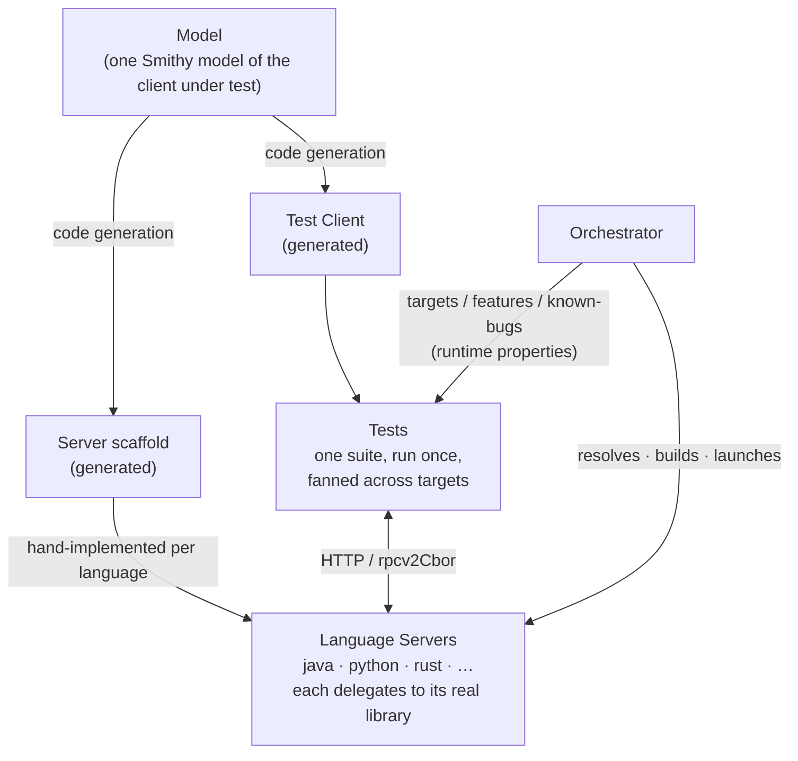
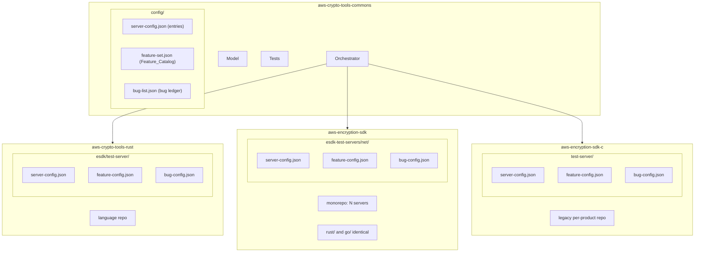
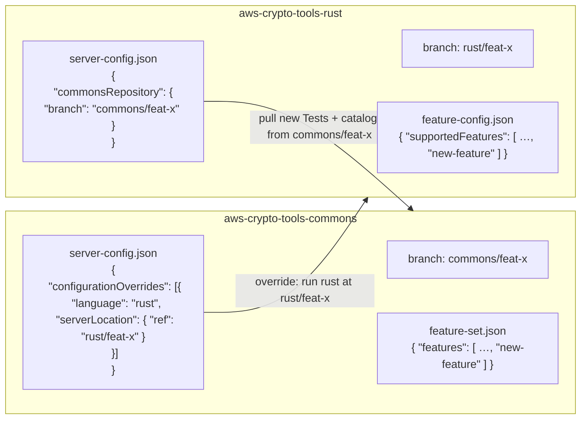
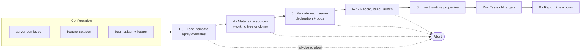
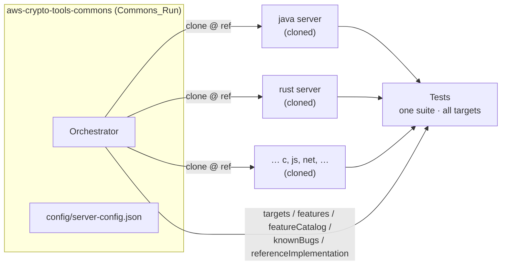
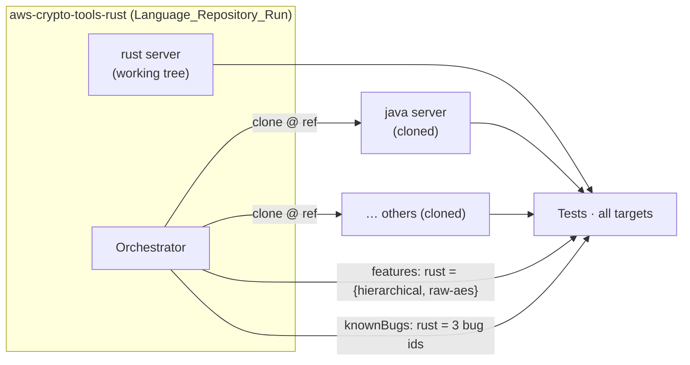
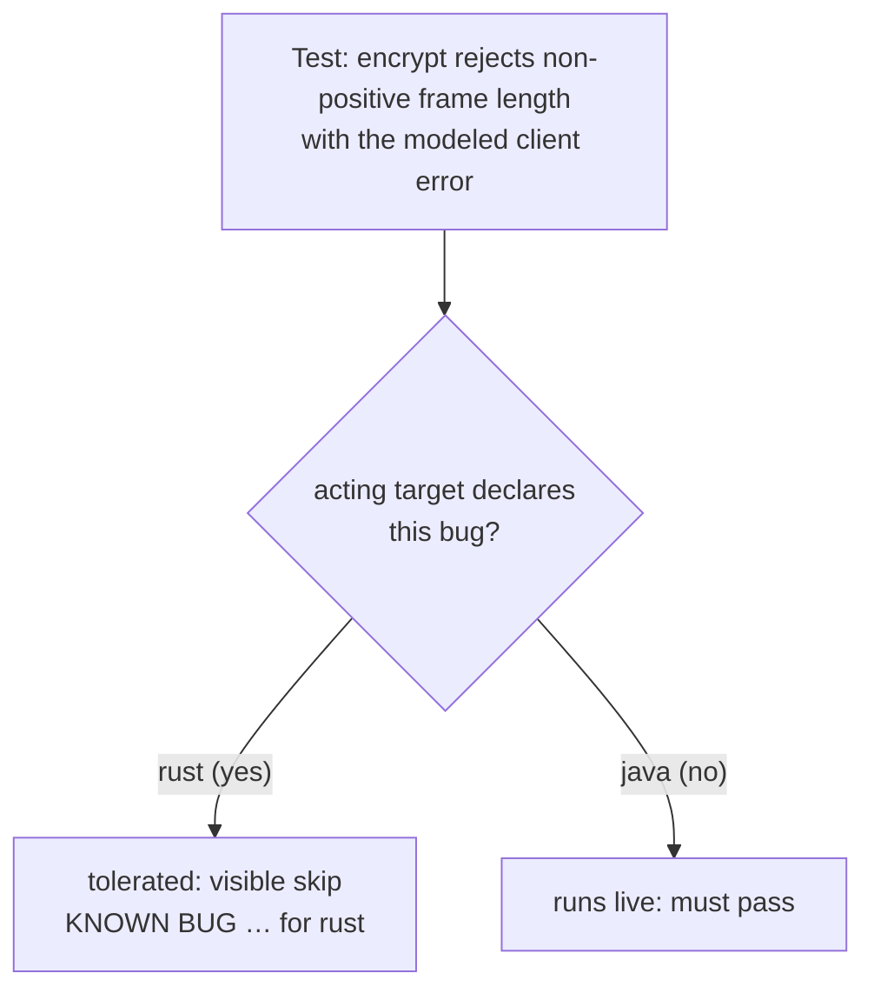
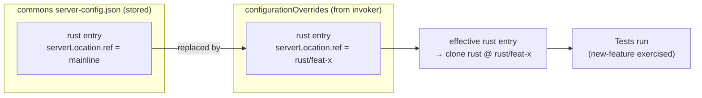
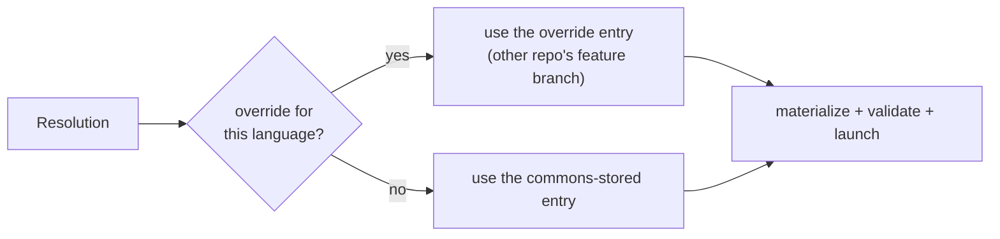

# TestServer Configuration Design Doc

*author: kessplas@*

*This document was hand-written with minimal use of LLMs, mostly to generate example config and diagrams.*

## Background

AWS Crypto Tools / Encryption at Rest own client-side encryption libraries for AWS. This includes the AWS Encryption SDK (ESDK), AWS Database Encryption SDK (DBESDK), and the Amazon S3 Encryption Client, as well as the Materials Provider Library and other miscellaneous supporting packages. These products are implemented in various different languages, and the different implementations are expected to behave the same way as each other. Crypto Tools has employed various mechanisms to ensure compatibility between language implementations of its products. This document fills in details of one such mechanism known as the TestServer. 

The TestServer is a framework for ensuring cross-language compatibility of software libraries. The TestServer consists of several principal components: the Model, the Tests, the Servers, and the Orchestrator (and its Configuration). The Model is a Smithy model of the client under test. The Tests contain a set of integration tests written against the client. The Orchestrator, via its Configuration, pulls in the source code of the various implementations of the client(s) under test, builds it, and launches the Servers. The Servers listen to HTTP requests from the client executing the Tests and proxy the request operations and their payloads to its language's implementation of client under test. See Appendix D - Diagrams for visual representations of this architecture.

This approach enables the team to write test cases once and be able to execute them against all of the language implementations in one process. There are other benefits: new language implementations still under development can draw upon the entire suite of TestServer test cases (once its Server is implemented, which should only take ~1 day at most). The full suite of tests runs in each repo's CI and will fail CI when a test case fails.

This document outlines the detailed design of the TestServer's Configuration as part of a framework (i.e. not for a specific language or product). The scope of this document is specific to the implementation of the TestServer framework itself. More specifically, this document is concerned with the nature of Configuration and its organization in the TestServer. 

## Assumptions

This document assumes that there are three classes of Configuration: Server, Feature, and Bug. For a discussion on why Features and Bugs are separate, see Appendix C.

This document assumes that there are presently known bugs in at least one ESDK implementation and that the team is willing to accept the presence of low-priority bugs as the current "green" state. In other words, the team would rather have a test case which exists, but is deliberately expected to fail in one or more languages, than have the TestServer/CI report failure until all known bugs are fixed. This includes bugs which may not be fixable without inducing a breaking change.

## Requirements and Goals

There are certain obvious requirements omitted, such as the requirement to be able to write test cases once and have them run against many libraries (in other words, for N languages, a test can be added in O(1) time rather than O(N)). This is implied by the overall concept. 

1. The TestServer MUST adhere to the new repository organizational structure (commons + languages)

   1. The TestServer MUST be able to support the old (per product-language) and the current (monorepo) organizational structure indefinitely
2. The TestServer MUST make it easy to perform various common workflows, such as adding a new feature in one or more languages or fixing a bug in a single language (enumeration of workflows can be found later in the document). 
3. The TestServer's common design MUST be suitable for all of Crypto Tools main products.
4. The TestServer MUST account for differences in feature support between language implementations. 

   1. These differences SHOULD be explicitly modeled and easy to reference. It SHOULD serve as a way to easily answer questions like "Does the ESDK JS support streaming?".
5. The TestServer MUST account for the existence of bugs in one, some, or all language implementations.
6. The TestServer MUST run in CI in the `commons` repo as well as each language/implementation repo. 

   1. Each CI run MUST (by default) run the full suite of tests against the latest code of each language/implementation. 

## Out of Scope

This document does not evaluate the TestServer against broadly different solutions to the same set of problems. This document does not evaluate which tests can/should be written in the TestServer.

This document does not consider details like which configuration language should be used. To provide examples, `json` is used in this document. These are implementation details which are subject to change independently from the design choices herein. 

This document does not propose any immediate timeline for moving to the new repository structure. 

## Issues and Alternatives

### Issue: Repository Organization

Requirement 1: The TestServer MUST adhere to the new repository organizational structure (commons + languages)

**Proposed Solution:** Split components between the `aws-crypto-tools-commons` repo and the various other repos, including the new language repos e.g. `aws-crypto-tools-rust`, the current monorepos e.g. `aws-encryption-sdk` , and the old per language/product repos e.g. `aws-encryption-sdk-python`. Specifically: the Tests, Orchestrator, and the canonical Configuration live in the `commons` repo. The Servers and a local Configuration instance live wherever the source code currently lives.

```
aws-crypto-tools-commons/esdk/test-server/config/
├── server-config.json
├── feature-set.json
└── bug-list.json

aws-crypto-tools-rust/esdk/test-server/
├── server-config.json
├── feature-config.json
└── bug-config.json

aws-encryption-sdk/esdk-test-servers/
├── net/
│   ├── server-config.json
│   ├── feature-config.json
│   └── bug-config.json
├── rust/
│   ├── server-config.json
│   ├── feature-config.json
│   └── bug-config.json
└── go/
    ├── server-config.json
    ├── feature-config.json
    └── bug-config.json

aws-encryption-sdk-c/test-server/
├── server-config.json
├── feature-config.json
└── bug-config.json
```

*Exhibit A: The directory structure of the Configuration for various repository organization schemes*

This solution adheres to the new repo organization best, as it keeps the shared Tests and utilities (Orchestrator) in one place but defers the per-language specifics to those repos. Via the Orchestrator and its Configuration, it is possible for the per-language Servers to live in any repo. This satisfies Requirement 1 and 1a. 

This also yields the simplest development workflows. When the Configuration for a given bug or feature is stored in the same repo as the source code, there is no need to reconcile them as is otherwise the case. 

When running in CI, the Orchestrator is responsible for Configuration Resolution. From `commons`, all of the relevant language repos must be cloned and initialized. Their own local Configuration must be parsed before running the Tests. Likewise, from a language repo, the `commons` repo must be cloned, then all of its configured language implementation repos cloned. Again, Configuration from each language repo is parsed and applied. This means that, for example, the Java repo running CI will be aware that Go doesn't implement streaming and skip its tests accordingly. The Orchestrator is also responsible for validating the Configuration. More details on Config Resolution can be found in Appendix F. 

**Alternative Solution:** Put everything in `aws-crypto-tools-commons`. This is technically possible and adheres to Requirement 1a. However, it does not adhere to Requirement 1, since it would involve putting per-language code in the `commons` repo, which is against its spirit. The `commons` repo should only contain that which is common to all languages. 

This solution results in more complicated development workflows as code changes in the various repos need to be synchronized against Configuration or Tests in `commons`. 

**Alternative Solution:** Depends on the product. Those with monorepos (DBESDK) can just get the TestServer in the monorepo. This option is a bit easier to implement in the short term but it does not adhere to Requirement 1a in the long term. The proposed solution can work with any repo organization model and is therefore more robust against future migrations. The short term gain is not worth the tech debt.

### Issue: Server Configuration Implementation

For the TestServer to be able to run its suite of tests against all of the language implementations of a given product, it must be able to resolve both the code and Server implementation. This applies to both the `commons` repo and the individual language repos themselves. 

**Proposed Solution:** The `commons` repo contains the authoritative copy of the Server Configuration. Each language MAY override the Server Configuration. This provides the most flexible solution for resolving which code/servers to use. 

```
{
  "product": "esdk",
  "entries": [
    {
      "language": "java",
      "majorVersion": 3,
      "port": 8091,
      "configPath": "esdk/test-server",
      "libraryRepository": {
        "name": "aws-crypto-tools-java",
        "url": "git@github.com:aws/aws-crypto-tools-java.git",
        "branch": "main",
        "path": "esdk"
      },
      "serverLocation": {
        "repository": "aws-crypto-tools-java",
        "url": "git@github.com:aws/aws-crypto-tools-java.git",
        "ref": "main",
        "path": "esdk/test-server/server"
      }
    }
  ]
}
```

*Exhibit B: Example of aws-crypto-tools-commons/esdk/test-server/config/server-config.json*

This approach adheres to Requirement 1 and 1a with one caveat as well as Requirement 2. The caveat is that this approach does require the `commons` repo to "know" about its language implementations via the Server Configuration. However, this is unavoidable; the `commons` repo MUST run its TestServers in CI to validate the correctness of its Tests. Therefore, some amount of Configuration is inevitable. 

This approach satisfies Requirement 2 as it allows language implementations to override the Configuration in `commons` which makes certain simpler workflows possible. 

**Alternative Solution:** The `commons` repo contains the only copy of Server Configuration. Each language's Configuration only points to the Server Configuration in `commons`. This approach is a bit simpler than the proposed solution. However, it is a bit more brittle as it requires strict conformance between feature implementation. It is impossible, for example, for the Java repo to point to a different branch of the Go repo in order to test against its feature branch. 

**Alternative Solution:** Use git Submodules. This approach is avoided for several reasons. Submodules do not update their commit by default, so significant maintenance effort would be required to keep Submodules up to date. Submodules are more useful when its inclusion is considered part of the source code rather than a dependency. 

### Issue: Feature Configuration Implementation

Requirement 4: The TestServer MUST account for differences in feature support between language implementations. 

**Proposed Solution:** The `commons` repo contains an authoritative set of features. Each language implementation contains in its Configuration entries for `unsupportedFeatures` and `supportedFeatures`. The union of the two sets MUST strictly equal the authoritative set in `commons`. 

```
{
  "product": "esdk",
  "features": [
    "streaming", "MPL", "hierarchical",
    "raw-aes", "raw-rsa", "raw-ecdh", "multi",
    "aws-kms", "aws-kms-multi", "aws-kms-discovery",
    "aws-kms-mrk", "aws-kms-mrk-multi", "aws-kms-mrk-discovery",
    "aws-kms-rsa", "aws-kms-ecdh",
    "required-encryption-context", "caching"
  ]
}
```

*Exhibit C: Example of aws-crypto-tools-commons/esdk/test-server/config/feature-set.json*

```
{
  "supportedFeatures": [
    "hierarchical",
    "raw-aes"
  ],
  "unsupportedFeatures": [
    "streaming", "MPL", "raw-rsa", "raw-ecdh", "multi",
    "aws-kms", "aws-kms-multi", "aws-kms-discovery", "aws-kms-mrk",
    "aws-kms-mrk-multi", "aws-kms-mrk-discovery", "aws-kms-rsa",
    "aws-kms-ecdh", "required-encryption-context", "caching"
  ]
}
```

*Exhibit D: Example of aws-crypto-tools-rust/esdk/test-server/feature-config.json*

This solution is preferred because it satisfies Requirement 4 as well as 4a. It provides a quick-glance view of which features exist for a given product, as well as which features are or aren't supported in a given language implementation. Additionally, it requires implementing languages to enumerate the entire set of features in their own configuration.

Furthermore, Tests need to be written against features; the set of features which the Tests are aware of is strictly related to the Tests, not Server implementations, as per Requirement 1.

The principal drawback is the relatively complicated workflow to add new features, requires a PR to `commons` as well as PRs to each language repo. However, a new feature would need new Tests and thus changes to the `commons` repo as well as the language repos anyway. 

**Alternative Solution:** Do not model features in the `commons` Configuration. This would allow new features to be added without necessarily making a PR against `commons`. However, it loses two of the pros of the proposed solution, and as stated above, a PR to `commons` is required to add test cases for the feature.

### Issue: Bug Configuration Implementation

**Proposed Solution:** Each language repo contains a list of known bugs which it currently exhibits. Like Feature Configuration, there is a common bug registry in `commons`. Unlike Feature Configuration, language repos only define the bugs which are present. 

```
{
  "product": "esdk",
  "bugs": {
    "encrypt-non-positive-frame-length-generic-error": {
      "description": "encrypt of a non-positive frame length is rejected as a GenericServerError instead of the modeled ESDKClientError",
      "ticketId": null
    },
    "decrypt-accepts-out-of-order-frame-sequence": {
      "description": "decrypt accepts a framed message whose frame sequence numbers are out of order",
      "ticketId": "ESDK-1234"
    },
    "default-frame-length-262144": {
      "description": "the default frame length is 262144 where every other implementation defaults to 4096 (a default-value difference, not a validation bug)",
      "ticketId": null
    }
  }
}
```

*Exhibit E: Example of <textStyle t="gray-1">aws-crypto-tools-commons/esdk/test-server/config/bug-list.json</textStyle>*

```
[
  "encrypt-non-positive-frame-length-generic-error",
  "raw-aes-reserved-namespace-rejected-as-esdk-error",
  "raw-aes-wrong-wrapping-key-length-rejected-as-esdk-error"
]
```

*Exhibit F: Example of aws-crypto-tools-rust/esdk-test-server/bug-config.json*

This solution is preferred. It is useful to aggregate all of the existing modeled bugs in the TestServer for the same reason that features are. Bugs must be accounted for in the Tests, and as such are a property of the Tests. For bugs which occur in multiple languages, there is one entry for the description and ticket ID, and it is easy to keep a consistent bug ID between the languages. There is no reason to track the absence of a bug.

When all instances of a bug are fixed, the entry in `commons` will become stale. In order to clean up such entries, automation can be implemented such that when for a given test run, one or more bugs are not present in any languages, a PR is cut against the repo which removes that bug from the list and removes the expected failure condition logic from the Tests code. 

**Alternative Solution:** The same as above, but without a central bug ledger. Only language repos store any bug Config. This approach is viable, and has the benefit that there is no need to reconcile stale bugs in `commons`. However, there are a few drawbacks. For bugs which exist in multiple languages, the bug IDs need to be the same, and other metadata such description, ticket ID will be duplicated. 

**Alternative Solution:** The `commons` repo contains a ledger of the various bugs across the languages including which languages contain the bug. Each language repo has a local `knownBugFixOverrides` entry in its Configuration. By default, it is empty. When a bug is fixed, the PR which fixes that bug adds the bug to the Configuration entry. This enables the tests which had previously failed due to the presence of the bug.

This solution is rejected. The bug ledger in the `commons` repo contains per-language details which breaks from tradition to keep anything per-language out of `commons`(Requirement 1). There is less value in centralizing which bugs exist in which language; it makes more sense for that information to live in the language repo. Additionally, it requires a Github action to reconcile bug fixes with `commons`to keep `commons` Configuration up to date. The `knownBugFixOverrides` does not strictly need to be cleared out after `commons` is reconciled but it will grow stale if it isn't and would require a separate automated process to clean up. 

**Alternative Solution:** Write the test cases such that tests associated with a known bug eagerly pass. In other words, if a test which is expected to fail passes instead, that test case passes. Then, only `commons` requires a Bug Config. When a given language fixes a bug, there is no local override needed. The test will simply pass in the PR as well as in `commons` once it is merged to the default branch of the language repo. There will be a stale entry in `commons` which should be cleaned up via automation. This is arguably the simplest workflow. However, there are other drawbacks. Unlike the proposed solution, the stale entry in `commons` is not just stale but misleading, as it would include the language/version target, and the language would still be present once the bug is fixed. Additionally, it is more difficult to follow TDD, since the tests pass both when the bug is fixed and when the bug is active. When fixing a bug, the engineer must be very careful to check the test report to ensure that the relevant test case(s) are now *actually* passing, and not just allowed to fail. Both result in green CI. This means that an unsuccessful attempt to fix a bug would still have green CI. This could be ameliorated by use of local override config, at which point this solution is roughly equivalent to the rejected solution immediately preceding this one.

# Appendix A - Development Workflows

Requirement 2: The TestServer MUST make it easy to perform various common workflows, such as adding a new feature in one or more languages or fixing a bug in a single language. Whenever possible, the TestServer SHOULD enable Test-Driven Development (TDD).

##### Scenario A: Fixing a bug in an existing language

1. On a new branch, make a code change to remove the bug from the `bug-config.json` file. The PR would fail as this change enables testing which asserts the correct behavior but the bug has not yet been fixed. At this time, both the default branch of the `commons` repo as well as the default branch per-language repo in question still pass CI as intended. 
2. Make a code change to fix the bug. The PR is now green and can be merged. 
3. Merge the PR. 
4. If there are no other implementations which contain this bug, automation runs against `commons` which removes the bug from `bug-list.json` .

##### Scenario B: Adding an existing feature to an existing language

1. Make a code change to move the feature from `unsupportedFeatures` to `supportedFeatures` in the local configuration. The PR would fail as the feature has not been implemented yet. 
2. Make a code change to add the feature. If needed, make a code change which adds the feature to the language's Server implementation (notably this is the same PR). The PR is now green and can be merged.
3. Merge the PR.

##### Scenario C: Adding a new feature to all existing languages

Note that this list focused on TestServer specific processes; it is assumed the usual development process (design, spec writing, ORR, etc.) will be followed in parallel. 

1. Update the Model to account for the new feature, if relevant. Run code generation so the Tests client is updated with the new API.
2. Make a code change to add an entry for the feature in the `features` list in the `commons` repo. Write tests that run against the feature when the feature is present. This PR would fail as none of the languages implement it yet. 
3. Write a reference implementation in one language. In that PR, point the config at the `commons/feature-branch` and enable the feature in the `supportedFeatures` config. Wire the new feature/API changes into the local Server. 

   1. This enables TDD against the test cases already written and a feedback loop where more tests can be written as the feature evolves/is completed. 
4. Once the reference implementation meets a certain bar, make PRs in the rest of the language repos. Likewise, start by pointing local Configuration at the `commons/feature-branch` created in steps 1 and 2 and mark the feature `supported`. The PRs should fail, as it hasn't been implemented yet.
5. Make code changes to the Server to support the feature. The PR should still fail. 
6. Make code changes to implement the feature using TDD until the PR is green. 
7. As languages come online, update the `commons/feature-branch` PR to point at the various `language/feature-branch` branches. This PR would run against those languages within the same CI, testing cross-language functionality of the feature.
8. Merge the commons PR, including the branch overrides. 
9. Update each `language/feature-branch` PR to point at `commons/mainline` now that the new Tests have been merged. 
10. Merge each `language/feature-branch` PR. 
11. Once merged, remove the branch override from the `commons/mainline` config. 

##### Scenario D: Making a breaking change to all languages

This is functionally the same as above except new Major Versions mean new Server implementations such that the total Configuration set includes the new Major Version for each language.

# Appendix B - Configuration Example

```
# Commons — the global trio
aws-crypto-tools-commons/esdk/test-server/config/
├── server-config.json          # product + entries (where code/servers live)
├── feature-set.json            # the Feature_Catalog
└── bug-list.json               # the bug ledger (catalog of all known bugs)

# New commons + language repo (one server in its own repo)
aws-crypto-tools-rust/esdk-test-server/
├── server-config.json          # commons pointer + product
├── feature-config.json         # this server's Feature_Declaration
└── bug-config.json             # the bugs this server exhibits

# Monorepo hosting several servers (one config directory per server)
aws-encryption-sdk/esdk-test-servers/
├── net/{server-config,feature-config,bug-config}.json
├── rust/{server-config,feature-config,bug-config}.json
└── go/{server-config,feature-config,bug-config}.json

# Old per-product-language repo
aws-encryption-sdk-c/test-server/
├── server-config.json
├── feature-config.json
└── bug-config.json
```

Commons `config/server-config.json` — `product` + one entry per server; `configPath` locates each server's file trio:

```json
{
  "product": "esdk",
  "entries": [
    {
      "language": "java",
      "majorVersion": 3,
      "port": 8091,
      "configPath": "esdk/test-server",
      "libraryRepository": {
        "name": "aws-crypto-tools-java",
        "url": "git@github.com:aws/aws-crypto-tools-java.git",
        "branch": "main",
        "path": "esdk"
      },
      "serverLocation": {
        "repository": "aws-crypto-tools-java",
        "url": "git@github.com:aws/aws-crypto-tools-java.git",
        "ref": "main",
        "path": "esdk/test-server/server"
      }
    }
  ]
}
```

Commons `config/feature-set.json`:

```json
{
  "product": "esdk",
  "features": [
    "streaming", "MPL", "hierarchical",
    "raw-aes", "raw-rsa", "raw-ecdh", "multi",
    "aws-kms", "aws-kms-multi", "aws-kms-discovery",
    "aws-kms-mrk", "aws-kms-mrk-multi", "aws-kms-mrk-discovery",
    "aws-kms-rsa", "aws-kms-ecdh",
    "required-encryption-context", "caching"
  ]
}
```

Commons `config/bug-list.json`:

```json
{
  "product": "esdk",
  "bugs": {
    "encrypt-non-positive-frame-length-generic-error": {
      "description": "encrypt of a non-positive frame length is rejected as a GenericServerError instead of the modeled ESDKClientError",
      "ticketId": null
    },
    "decrypt-accepts-out-of-order-frame-sequence": {
      "description": "decrypt accepts a framed message whose frame sequence numbers are out of order",
      "ticketId": "ESDK-1234"
    },
    "default-frame-length-262144": {
      "description": "the default frame length is 262144 where every other implementation defaults to 4096 (a default-value difference, not a validation bug)",
      "ticketId": null
    }
  }
}
```

Per-server `server-config.json`:

```json
{
  "commonsRepository": {
    "name": "aws-crypto-tools-commons",
    "url": "git@github.com:aws/aws-crypto-tools-commons.git",
    "branch": "main"
  },
  "product": "esdk"
}
```

Per-server `feature-config.json`:

```json
{
  "supportedFeatures": [
    "hierarchical",
    "raw-aes"
  ],
  "unsupportedFeatures": [
    "streaming", "MPL", "raw-rsa", "raw-ecdh", "multi",
    "aws-kms", "aws-kms-multi", "aws-kms-discovery", "aws-kms-mrk",
    "aws-kms-mrk-multi", "aws-kms-mrk-discovery", "aws-kms-rsa",
    "aws-kms-ecdh", "required-encryption-context", "caching"
  ]
}
```

Per-server `bug-config.json` — the bug ids this server exhibits (`[]` when none):

```json
[
  "encrypt-non-positive-frame-length-generic-error",
  "raw-aes-reserved-namespace-rejected-as-esdk-error",
  "raw-aes-wrong-wrapping-key-length-rejected-as-esdk-error"
]
```

Per-server `server-config.json` **with an override** — a repo can replace another language's commons entry (e.g. to point the run at a feature branch during a cross-language rollout) via `configurationOverrides`, each a complete entry:

```json
{
  "commonsRepository": {
    "name": "aws-crypto-tools-commons",
    "url": "git@github.com:aws/aws-crypto-tools-commons.git",
    "branch": "main"
  },
  "product": "esdk",
  "configurationOverrides": [
    {
      "language": "rust",
      "majorVersion": 1,
      "port": 8093,
      "configPath": "esdk-test-server",
      "libraryRepository": {
        "name": "aws-crypto-tools-rust",
        "url": "git@github.com:aws/aws-crypto-tools-rust.git",
        "branch": "my-feature-branch",
        "path": "esdk"
      },
      "serverLocation": {
        "repository": "aws-crypto-tools-rust",
        "url": "git@github.com:aws/aws-crypto-tools-rust.git",
        "ref": "my-feature-branch",
        "path": "esdk-test-server"
      }
    }
  ]
}
```

# Appendix C - Bugs vs Features

Features and bugs should remain in different categories for several reasons. Features are specifically designed, specified, and modeled, whereas bugs arise spontaneously as a side effect of developing new features or due to changes in dependency behavior over time.

It is useful to require each entry in the total set of features to be present in the Configuration of each language implementation for two reasons. First, this ensures that the implementor has considered whether or not to implement each feature. Features are less likely to be missed or forgotten, particularly when using the TestServer for TDD. Second, the configuration serves as a strict, test-enforced reference on which features a given library implements. This is a useful reference, as Crypto Tools/EAR has many products in many languages, and many have varying feature support.

It is not useful to require bugs to be represented in this fashion. It is a given that languages should not have bugs; there is nothing to be gained by enumerating the set of bugs absent from a given language implementation. 

Finally, the set of bugs is ostensibly larger if not much larger than the set of features. The set of features is finite, relatively small, and grows slowly. Its cardinality does not directly scale with the number of language implementations. The set of bugs, however, is generally at least as large as the set of features and tends to grow over time and with the introduction of new language implementations. 

# Appendix D - Diagrams

Hastily LLM-generated Mermaid diagrams:

**Overall Architecture Diagram**



**Repository Layout Diagram** (click to enlarge)



**Scenario C** - Adding a new feature



# Appendix E - Changelog

- Reviewed on 09/04. 
- Updates:

  - added new Requirement to run TestServer in CI in all repos
  - added Assumptions section
  - added Appendix E - Changelog 
- added Appendix F - Config Resolution
- add another Alternative Solution to Bug Config involving eager passing
- tweak Bug Config schema to key on Bug ID
- rename config files in `commons` as they have different semantics there than in implementation repos
- add a note about Config Resolution

<!-- -->

- Reviewed on 09/10

# Appendix F — Configuration Resolution

*Editorial: Warning: AI Slop ahead! It is correct enough though.* 

The Orchestrator turns Configuration into a run through a **fail-closed** pipeline: any problem in steps 2–7 aborts before a single Test executes, so a run either produces a full pass/fail matrix or a clean abort naming the cause. There are two run modes:

- **Commons_Run** — invoked in `aws-crypto-tools-commons` (its CI). Every server is resolved from its repository at the ref pinned in `server-config.json`.
- **Language_Repository_Run** — invoked from a language repo (its CI). That repo's **working tree** is used for its own server; the other servers are cloned. The invoking repo may also supply `configurationOverrides` to redirect *other* languages' entries (Scenario C).

## The resolution sequence

1. **Determine run mode and own language** — Commons_Run (no own language) or Language_Repository_Run (the invoking repo's language).
2. **Load + validate commons Configuration** from `config/`:

   - `server-config.json` → `product` + `entries` (each entry's `configPath`, `libraryRepository`, `serverLocation`, port, majorVersion),
   - `feature-set.json` → the Feature_Catalog,
   - `bug-list.json` → the bug ledger. Structural validation runs here (unique ports, catalog well-formed, ledger ids unique + non-blank). Pure — nothing is cloned yet.
3. **Apply** `configurationOverrides` from the invoking repo's `server-config.json`: each override is a complete entry that *replaces* the commons-stored entry for another language. (An override naming the own language, or a language with no stored entry, is rejected.)
4. **Resolve + materialize sources** for every effective entry: the `libraryRepository` and `serverLocation` at the pinned ref. The own language (Language_Repository_Run) resolves to its working tree; every other server is cloned. De-duplicated: a library and server on the same tree share one clone.
5. **Load + validate each server's declaration** from its `configPath`:

   - `feature-config.json` → its Feature_Declaration. Validated against the catalog: every catalog feature in **exactly one** of `supportedFeatures`/`unsupportedFeatures`, no unknown names, no conflicts; optional `rawRsaPaddingSchemes` checked; `product` must match commons.
   - `bug-config.json` → the flat list of bug ids the server currently exhibits. (No cross-check against the ledger yet — that's the future reconciler.)
6. **Emit the Resolution_Record** (stdout + JSON) — the exact sources, refs, and outcomes — *before* any launch, so every run is auditable even on abort.
7. **Build + launch** each server on its configured port, then re-check reachability across all ports. Tests start only once every server is reachable.
8. **Inject runtime properties** into the one Tests JVM and **run the Tests once**, fanned across the `(encrypt, decrypt)` target matrix:

   - `esdk.testserver.targets` = `lang:major:repo=url` per launched server,
   - `esdk.testserver.features` = `lang:feat=bool;…` (flattened declarations) + `esdk.testserver.featureCatalog`,
   - `esdk.testserver.rawRsaPaddingSchemes` (only languages that declare it),
   - `esdk.testserver.knownBugs` = `lang:major:repo=id;…` (each server's exhibited bugs),
   - `esdk.testserver.referenceImplementation`. The Tests consult these at gate time: `FeatureDeclarations` skips a feature-gated row for a target that doesn't support it; `KnownBugGate` tolerates exactly the assertion a declared bug breaks for the acting target.
9. **Report** the pass/fail matrix and **teardown** every launched server (always, in a `finally`).



---

## Example 1 — Commons_Run

Commons CI validates its own Tests against every language. There is no own language; all servers are cloned.

1. Mode: **Commons_Run**.
2. Load `config/server-config.json` (entries for java, rust, …), `feature-set.json` (17-feature catalog), `bug-list.json` (ledger). Validate → OK.
3. No overrides (a Commons_Run supplies none).
4. Clone every server at its pinned ref (java @ its branch, rust @ its branch, …).
5. For each, read `<configPath>/feature-config.json` + `bug-config.json`; validate each declaration against the catalog + product match.
6. Emit the Resolution_Record.
7. Build + launch all servers; confirm reachability.
8. Inject the properties and run the one Tests suite across the full matrix.
9. Report + teardown.



---

## Example 2 — Language_Repository_Run (a server with a bug + a narrower feature set)

Invoked from `aws-crypto-tools-rust`. Rust's **working tree** is its own server; the others are cloned. Rust supports a narrower feature set and currently exhibits a bug; java has the broader set and does not.

1. Mode: **Language_Repository_Run**, own language = `rust`.
2. Load commons Configuration (from the commons clone rust's `commonsRepository` points at). Validate → OK.
3. No overrides (rust supplies none here).
4. Materialize: **rust from its working tree**; java and the rest cloned.
5. Load declarations:

   - rust `feature-config.json`: `supportedFeatures = [hierarchical, raw-aes]`, everything else unsupported. `bug-config.json`: `["encrypt-non-positive-frame-length-generic-error", "raw-aes-reserved-namespace-rejected-as-esdk-error", "raw-aes-wrong-wrapping-key-length-rejected-as-esdk-error"]`.
   - java `feature-config.json`: broad support (streaming, aws-kms, …); `bug-config.json`: does **not** list those ids.
6. Emit the Resolution_Record.
7. Build + launch; reachability OK.
8. Inject — including `esdk.testserver.knownBugs = rust:1:aws-crypto-tools-rust=encrypt-non-positive-frame-length-generic-error;raw-aes-reserved-namespace-rejected-as-esdk-error;raw-aes-wrong-wrapping-key-length-rejected-as-esdk-error`. At gate time:

   - a rust row for a feature rust doesn't support (e.g. `aws-kms`) is **feature-skipped**;
   - the row asserting correct non-positive-frame-length behavior is **tolerated for rust** (declared bug) but runs live and must pass for java (which doesn't declare it);
9. Report + teardown.



Gate behavior for the shared row:



---

## Example 3 — Server Config override (Scenario C: adding a new feature)

During a cross-language rollout, the `commons/feat-x` run redirects rust's entry to rust's feature branch via `configurationOverrides`, so one CI run exercises the new Tests against rust's in-progress server.

1. Mode: **Commons_Run** on `commons/feat-x` (catalog already includes `new-feature`).
2. Load Configuration (catalog has `new-feature`).
3. **Apply override**: the invoking config's `configurationOverrides` replaces the stored rust entry with one pinned at `rust/feat-x`.
4. Materialize: rust cloned at `rust/feat-x` (per the override); others at their normal refs.
5. Validate declarations — rust's `feature-config.json` on `rust/feat-x` marks `new-feature` supported. 6–9. Record → launch → run → report as usual; the run tests `new-feature` cross-language against rust's branch.

The override entry, in the invoking `server-config.json`:




